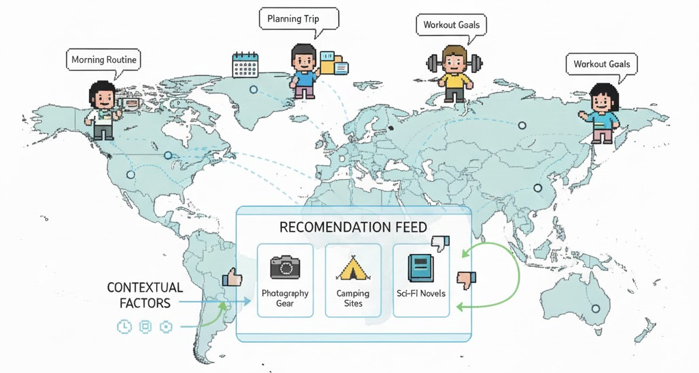

# ContextSim

<div id="top" align="center">
<p align="center">

</p>
</div>


ContextSim is an LLM-agent framework that simulates believable user proxies for recommender system evaluation by anchoring interactions in daily life activities. It generates contextual scenarios specifying when, where, and why users engage with recommendations, and aligns agent preferences with genuine humans through internal thought modeling and action/trajectory-level consistency.

It is designed to support **offline A/B testing correlation**, **context-aware user simulation**, and **RS parameter optimization** without expensive online experiments.

---

## Key Ideas
- **Context-aware user simulation**: ContextSim generates daily life scenarios that specify temporal, spatial, situational, goal, and constraint context, so agent interactions are grounded in realistic circumstances rather than happening in isolation.
- **Persona initialization from interaction history**: candidate personas (demographics, Big Five personality, habits, preferences) are generated from real user data, scored for consistency, and enriched with inferred preferences and goals.
- **Thought synthesis for alignment**: two SFT training datasets are constructed — item disentanglement (D_ID) explains why a rating fits a persona, and trajectory alignment (D_TA) explains why a chosen action is preferred over alternatives.
- **Multi-step interaction loop**: agents screen items on each page, infer internal state (fatigue, curiosity, boredom), generate thoughts before selecting actions, and reflect after each step — producing full interaction trajectories.
- **Bridging offline and online evaluation**: ContextSim-generated interactions correlate with online A/B test outcomes, and RS parameters optimized using ContextSim yield improved real-world engagement.


---

## Features
- Multi-step interaction rollouts (page screening, thought + action selection, reflection, rating)
- Persona- and context-conditioned decisions with internal reasoning traces
- Life simulation module with engagement check and context summarization
- Episodic memory for long-horizon consistency across sessions
- Evaluation prompts for believability checking, post-interview satisfaction, and human-vs-AI detection

---

## Code Structure

```
src/prompts/                         # All prompt templates (format-string ready)
├── persona_candidate_generation.py  # Generate candidate personas from interaction history
├── persona_consistency_scoring.py   # Score persona-history consistency (0.0–1.0)
├── preference_inference.py          # Infer natural-language preference descriptions
├── goal_inference.py                # Infer recent goals from prior sessions
├── item_disentanglement.py          # Explain why a rating fits the persona (D_ID for SFT)
├── trajectory_alignment.py          # Explain why an action beats alternatives (D_TA for SFT)
├── context_summarization.py         # Summarize 30-day life simulation into context text
├── engagement_check.py              # Decide whether to engage with the RS at a time slot
├── item_screening.py                # [WATCH]/[SKIP] screening for page items
├── internal_state.py                # Infer fatigue, curiosity, boredom (1–3 scale)
├── thought_and_action.py            # Generate thought + select next action
├── action_reflection.py             # Post-action self-reflection for episodic memory
├── rating_prediction.py             # Predict rating for an unseen item
├── post_interview.py                # Post-session satisfaction scoring (1–10)
├── believability_evaluator.py       # Believability check + LLM human-vs-AI evaluator
├── page_formats.py                  # Page rendering templates (recommendation + shopping)
├── domain_configs.py                # Per-domain settings (MovieLens, AmazonBook, Steam, OPeRA)
└── __init__.py                      # Re-exports all prompts and configs
```
---

## Abstract
Recommender systems are central to online services, enabling users to navigate through massive amounts of content across various domains. However, their evaluation remains challenging due to the disconnect between offline metrics and online performance. The emergence of Large Language Model-powered agents offers a promising solution, yet existing studies model users in isolation, neglecting the contextual factors such as time, location, and needs, which fundamentally shape human decision-making. In this paper, we introduce ContextSim, an LLM agent framework that simulates believable user proxies by anchoring interactions in daily life activities. Namely, a life simulation module generates scenarios specifying when, where, and why users engage with recommendations. To align preferences with genuine humans, we model agents' internal thoughts and enforce consistency at both the action and trajectory levels. Experiments across domains demonstrate closer alignment with human behavior than prior work. We further validate our approach through offline A/B testing correlation and show that RS parameters optimized using ContextSim yield improved real-world engagement.
